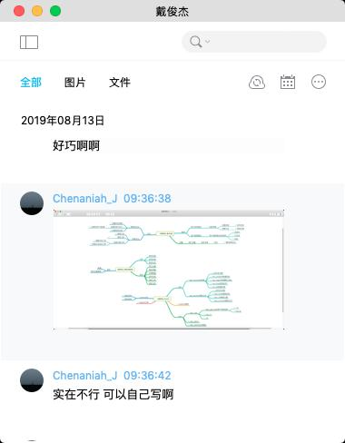
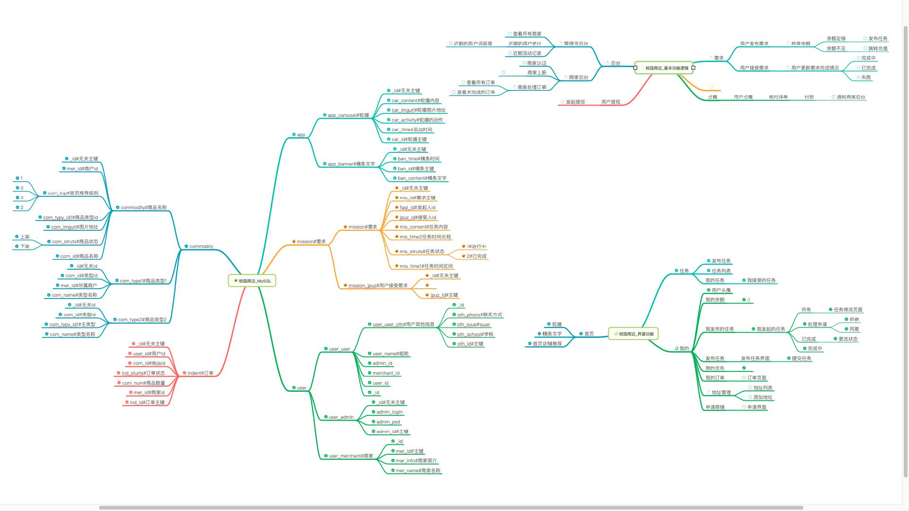

# TODEY校园_uniapp
> ## 基本信息   
 
    最后更新时间:2019年08月15日21:40:02  
	  
> ## 简单介绍  
 
    围绕两个主体功能和拓展功能的一个小程序，两个主体功能是商城下单和类似于跑腿的功能。  
	额..以上是客户的原话
	翻译过来就是,我需要一个学生点餐系统,加学生发布任务系统综合的一个小程序
	我简单的说下这个项目的起因
	
	事情是这样的......
	然后  我说:那我们(我)自己写一个吧 :), 

	
	然后本项目就正式启动了,
	
	
	再然后,我为啥发到GitHub了呢,这就是 不为人知的事情了  
    
> ## 技术栈  
  ### 后端
    后端项目见..   
    springboot + mybatis + jwt + generate 

  ### 前端
    vue + ajax + uniapp
	ui库用的colorui
	colorui是真的好看(吹爆可以嘛~)
	
> ## 更新记录(或者项目打开记录)  

```
时间:2019年08月13日 
1. 项目启动
```
```
时间:2019年08月14日  
1.任务模块基本完成,准备搞搞点餐模块
感觉不带后台,开发应该很快
```
```
时间:2019年08月15日21:58:29
1.出去了一天,第一次因为没写代码二内疚...
2.就是这个点准备将项目开源,然后尽量每个页面文件夹有READER.md,然后代码尽量多写注释
(我最讨厌两种人,一种是不写注释的人了,另一种是让我写注释的人) :)
3.更新一下13号那天画的结构图(非专业图,)
```
